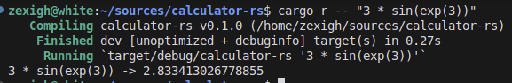

# Really simple calculator in Rust

This is a really simple calculator that can parse and compute mathematical expressions.

## Rust 

This project is written in Rust and uses the `tracing` crate for logging.

The parser is a top-down operator precedence parser. It supports the following operators:

- `+`
- `-`
- `*`
- `/`

And the following functions:

- `sin`
- `cos`
- `tan`
- `exp`
- `log`
- `log2`
- `log10`
- `sqrt`

It also supports parentheses and nested expressions.

And supports unary operators `+` and `-`.

This has been written to be a simple educational tool to understand how to parse mathematical expressions in Rust without any external dependencies.

## Examples

```bash
cargo run -- "1 + 2 * sin(1.9)"
```

```text
1 + 2 * sin(1.9) -> 2.892600175374829
```

## Usage

```bash
cargo run -- --help
```

You can also see the tokens in the expression with the `--show-tokens` flag:

```bash
cargo run -- "1 + 2 * sin(1.9)" --show-tokens
```

```text
[Number(1.0), Operator('+'), Number(2.0), Operator('*'), Function("sin"), LeftParen, Number(1.9), RightParen]
1 + 2 * sin(1.9) -> 2.892600175374829
```

And the AST with the `--show-ast` flag:

```bash
cargo run -- "1 + 2 * sin(1.9)" --show-ast
```

```text
BinaryOp(Number(1.0), '+', BinaryOp(Number(2.0), '*', Function("sin", Number(1.9))))
1 + 2 * sin(1.9) -> 2.892600175374829
```



## License

This project is licensed under the MIT license. See the [LICENSE](LICENSE) file for more details.
